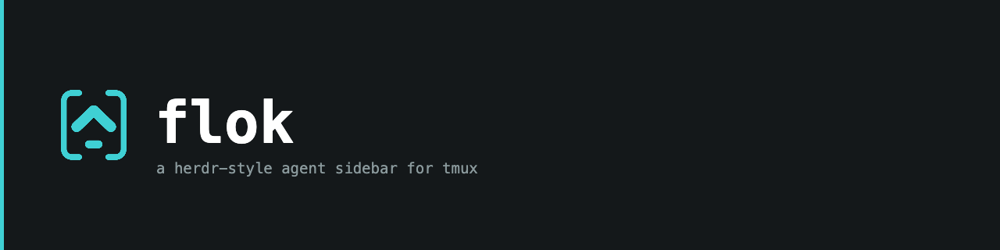

For the last year or so my working day has looked roughly like this: one terminal, one tmux server, a handful of sessions, and inside most of them a [Claude Code](https://claude.com/claude-code) agent doing something for me. One is refactoring a Go package. Another is writing a Hugo migration. A third is waiting for me to approve a `git push` and has been waiting for twenty minutes, because I forgot about it.

That last part is the whole problem. Agents are wonderful until you have more than two of them. Then they turn into a room full of interns who all want a word, and you cannot see which hand is raised.

[flok](https://github.com/w4jnl/flok) is my answer to that. It is a small, single-binary Go program that adds one narrow pane to the left of your normal tmux and shows, at a glance, every session and every agent, with a coloured dot that tells you what it is doing. It plays a sound when an agent gets stuck or finishes somewhere you are not looking. And it stays out of the way of everything else.

## What it looks like

This is the sidebar, sitting next to my regular tmux, which is entirely unchanged:

```
┌──────────────────────────┬────────────────────────────────────────┐
│ sessions                 │                                        │
│  ◑ Claude          main  │   your normal tmux server, untouched   │
│  ○ Hugo            main  │   (sessions, windows, plugins, keys)   │
│  ● flok            main  │                                        │
│                          │                                        │
│ agents · 1     priority  │                                        │
│  ● flok        perm:Bash │                                        │
│    claude · feasibility  │                                        │
│  ◑ trading-jou… Bash 0:42│                                        │
│    claude · add-settle…  │                                        │
│  ○ mwrelay               │                                        │
│    claude · store-forwa… │                                        │
│ j/k ⏎ ⇥ 1-9      ? help  │                                        │
└──────────────────────────┴────────────────────────────────────────┘
```

Two panels. **Sessions** on top, each with its git branch and a state dot rolled up from the agents inside it. **Agents** below, sorted by how badly they need you: the ones waiting for a permission or an answer come first, then the ones that finished while you were elsewhere, then the ones still working, then the idle ones.

Each agent gets two lines: what it is working on, and which agent it is plus the title of its own conversation. The `perm:Bash` on the first row means "Claude wants to run a shell command and is waiting for you to say yes". The `Bash 0:42` on the second one means "Claude is running a shell command and has been at it for 42 seconds".

The dots are the language you learn in about a minute:

| dot | colour | meaning |
|---|---|---|
| `◐◓◑◒` (spinning) | cyan | working |
| `●` | orange | blocked, it needs you |
| `●` | green | done, and you have not looked at it yet |
| `○` | grey | idle |

That is genuinely most of it. Press `prefix o` and you jump to whatever needs you most. Press `Enter` on a row, or click it, and you are there. Press `prefix b` and the sidebar collapses to a six-column rail; `prefix B` hides it completely. Press `prefix ?` and you get a popup listing every key your tmux actually has bound right now, grouped and searchable, which turned out to be a feature I use far more than I expected.

## Where the idea came from

I did not invent this. [herdr](https://herdr.dev) did, and the sidebar in herdr is exactly the thing I wanted. herdr is a full terminal application, though, and I already had a terminal setup I liked: [Ghostty](https://ghostty.org), tmux, a pile of plugins, years of muscle memory. I did not want to replace all of that to get a sidebar.

So flok is the herdr sidebar, rebuilt as something that wraps around the tmux you already have instead of replacing it. The name is a nod to that: a flock of agents, watched from the side. herdr's detection rules and its two notification sounds are used unchanged, under their Apache licence, and the README says so up front. They set the bar for what this should feel like.

## The trick that makes it harmless

The one design decision that everything else hangs on is that **flok never touches your tmux server**. Not its config, not its plugins, not its windows, not its layouts.

Instead, it runs a second, tiny tmux server of its own. That outer server has no prefix key and no status bar, so it is invisible. It has exactly one window with two panes: the sidebar on the left, and on the right a plain `tmux attach` to your normal server.


%%{init: {"theme":"base","themeVariables":{"primaryColor":"#e3f4f5","primaryTextColor":"#14181A","primaryBorderColor":"#12999D","secondaryColor":"#fbe9d4","secondaryBorderColor":"#E8963C","tertiaryColor":"#eef1f1","tertiaryBorderColor":"#8A999C","lineColor":"#8A999C","textColor":"#14181A","nodeTextColor":"#14181A","clusterBkg":"#f3f6f6","clusterBorder":"#8A999C","titleColor":"#14181A","edgeLabelBackground":"#eef1f1","labelBackgroundColor":"#eef1f1","labelColor":"#14181A"}}}%%
flowchart LR
    T["Terminal<br/>(Ghostty, iTerm2, kitty …)"]
    subgraph O["outer tmux (socket flok)"]
        S["sidebar<br/>(flok)"]
        A["tmux attach"]
    end
    subgraph I["your normal tmux"]
        S1["session Claude"]
        S2["session Hugo"]
        S3["session …"]
    end
    T --> O
    A -- "every key and mouse event, unchanged" --> I
    S -. "reads state · switch-client" .-> I


Every keystroke and every mouse event passes straight through the outer server to the inner one, so your prefix, your bindings, your copy mode and your plugins all keep working exactly as before. The sidebar just reads the inner server (which sessions exist, which panes run an agent) and, when you ask it to jump somewhere, tells your client to switch. That is all it is allowed to do.

The practical upshot: `flok up` to start it, `prefix d` to detach as usual and you are back at a plain shell with your tmux server still running underneath. If you decide you hate it, `flok down` and nothing is left behind.

## How it knows what an agent is doing

This was the part I expected to be fiddly, and it was.

Claude Code and GitHub Copilot CLI both have **hooks**: little commands they run on events like "the user submitted a prompt", "I am about to run a tool", "I need permission", "I am done". `flok install` registers `flok hook claude` for those events. Every event is a tiny process that writes one JSON file per tmux pane and, if the agent needs you and you are looking somewhere else, plays a sound. The sidebar watches those files and repaints instantly.

Hooks are exact, but they are not complete. Press `Esc` in the middle of a turn, hit a usage limit, or run an agent started before you installed flok, and no hook tells you the turn is over. So flok also has three fallbacks, in order of how much it trusts them:

1. Claude Code's own list of running sessions (`claude agents --json`), matched to a pane by its tty.
2. The pane title, where Claude Code draws a spinner glyph while it works.
3. herdr's screen rules, which look at the visible text of the pane and recognise things like "the empty prompt box is showing" or "there is a permission dialog on screen".

The hook record wins when it exists. The others only step in to correct it in a few narrow, deliberate cases, such as clearing a "working" state that no hook ever closed. Agents without hooks at all (Codex, Gemini, OpenCode) get the title and screen rules only, which is less exact but still useful.

The rule I care most about is a small one: **an agent that finishes while you are watching it is simply idle, not "done"**. You saw it. No sound, no green dot, no unread count. Only the pane you are *not* looking at gets to demand attention. That one rule is the difference between a tool that helps and a tool that nags.

## Little things that turned out to matter

**Sounds are debounced.** If ten agents finish within the same second, you hear one beep, not ten. Nothing plays for the pane in front of you.

**The keybinds help is live.** `prefix ?` does not show a hand-written cheat sheet. It asks your tmux server for its bindings, keeps tmux's own descriptions for the stock ones, translates the rest into plain words ("pane left"), and groups plugin bindings by plugin. Whatever is bound right now is what you see.

**A menu bar icon on macOS.** Optional, but I keep it on. The flok mark sits in the menu bar, spins while agents work, turns orange with a count when one is waiting, and a click on an agent in the dropdown brings the terminal window to the front and puts you on that pane. It is a separate small process that reads a JSON snapshot the sidebar publishes, so the terminal sidebar itself stays free of anything platform-specific.

**Light terminals get a light theme.** When it starts, flok asks the terminal what its background colour is and picks Dracula or its light sibling Alucard accordingly, and recolours the pane border to match.

**It works over ssh, on old servers.** On a remote host without a sound player, flok rings the terminal bell instead, which your local terminal turns into a sound. And because I still have RHEL 8 boxes to look after, it runs on tmux 2.7 with a few features gracefully switched off. CI runs the end-to-end suites on macOS, Ubuntu, Rocky 9 and Rocky 8, each on their stock tmux.

**It restores your conversations.** If you use tmux-resurrect, an opt-in hook makes flok note the exact Claude conversation ID in each pane at every save. After a reboot, the pane comes back with `claude --resume <that-id>` rather than a fresh chat, or with a plain shell if it is not sure. Guessing wrong would be worse than not guessing.

## Getting it

It is Homebrew on macOS and a static binary on Linux:

```sh
brew install w4jnl/tap/flok      # macOS
flok install                      # hooks for Claude Code / Copilot, config, tmux snippet
flok doctor                       # tells you what is missing
flok up                           # from a plain terminal, not inside tmux
```

Paste the printed snippet into your tmux.conf below the tpm line, restart any agents that were already running so they pick up the hooks, and that is it.

## Honest caveats

flok is a personal tool that I published because there was no reason not to. The features are the ones I need, macOS is the first-class platform, Linux gets the terminal sidebar without the menu bar, and there is no compatibility promise between versions yet. The README says all of this plainly, and I would rather say it here too than have someone be surprised.

If you run several agents in tmux and have ever left one waiting for permission for twenty minutes, it might be worth a try. If you want to know how it actually works inside, the two-server design, the state machine, why the sidebar uses almost no CPU, I wrote that up separately on the [W4J site](https://w4j.nl/posts/flokdeepdive/).


