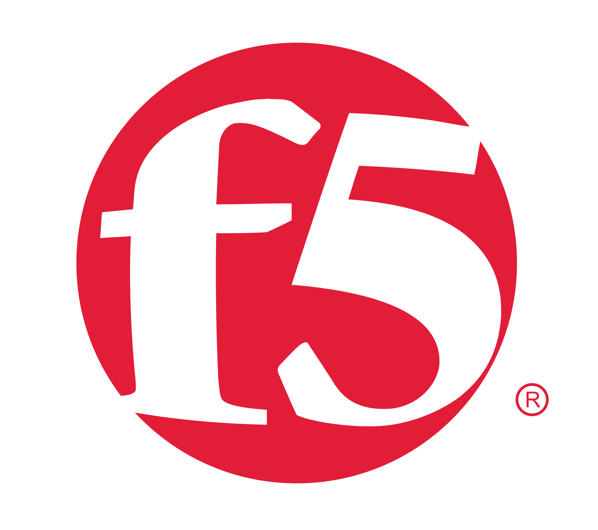

## Experience

<table>
    <thead>
        <tr>
            <th>Company</th>
            <th>Link</th>
            <th>Role</th>
            <th>Dates</th>
            <th>Location</th>
        </tr>
    </thead>
    <tbody>
        <tr>
            <td></td>
            <td><a href="https://www.shell.com/" target="_blank">Shell</a></td>
            <td>Systems Engineer, Software Developer</td>
            <td>2019 - Present</td>
            <td>Den Haag, Netherlands</td>
        </tr>
        <tr>
            <td></td>
            <td><a href="https://www.unhcr.org/" target="_blank">UNHCR</a></td>
            <td>Senior Software Developer</td>
            <td>2017 - 2019</td>
            <td>Kakuma, Kenya</td>
        </tr>
        <tr>
            <td></td>
            <td><a href="https://www.f5.com/" target="_blank">F5 Networks</a></td>
            <td>SDC Delivery Consultant</td>
            <td>2013 - 2017</td>
            <td>EMEA region</td>
        </tr>
        <tr>
            <td></td>
            <td><a href="https://www.odido.nl/" target="_blank">T-Moble NL</a></td>
            <td>Senior VAS Engineer</td>
            <td>2010 - 2013</td>
            <td>Den Haag, Netherlands</td>
        </tr>
        <tr>
            <td></td>
            <td><a href="https://www.ericsson.com/" target="_blank">Ericsson</a></td>
            <td>Services Support Engineer</td>
            <td>2007 - 2010</td>
            <td>Rijen, Netherlands</td>
        </tr>
        <tr>
            <td></td>
            <td><a href="https://www.odido.nl/" target="_blank">Orange NL</a></td>
            <td>Senior Support Engineer</td>
            <td>2000 - 2007</td>
            <td>Den Haag, Netherlands</td>
        </tr>
        <tr>
            <td></td>
            <td><a href="https://www.orange.sk/" target="_blank">Globtel (Orange)</a></td>
            <td>BSS Support Engineer</td>
            <td>1996 - 2000</td>
            <td>Banska Bystrica, Slovakia</td>
        </tr>
    </tbody>
</table>

---

## Education

<table>
    <!-- <thead> -->
    <!--     <tr> -->
    <!--         <th>School</th> -->
    <!--         <th>Link</th> -->
    <!--         <th>Degree</th> -->
    <!--         <th>Date</th> -->
    <!--     </tr> -->
    <!-- </thead> -->
    <tbody>
        <tr>
            <td></td>
            <td><a href="https://www.aos.sk/en" target="_blank">Military Technical University</a></td>
            <td>MSc. Telecommunication Systems</td>
            <td>1991-1996</td>
        </tr>
    </tbody>
</table>

## PDF Resume

Full version available to download <a class="example_d" href="CV_J_ZAJONC.pdf">here</a>.
